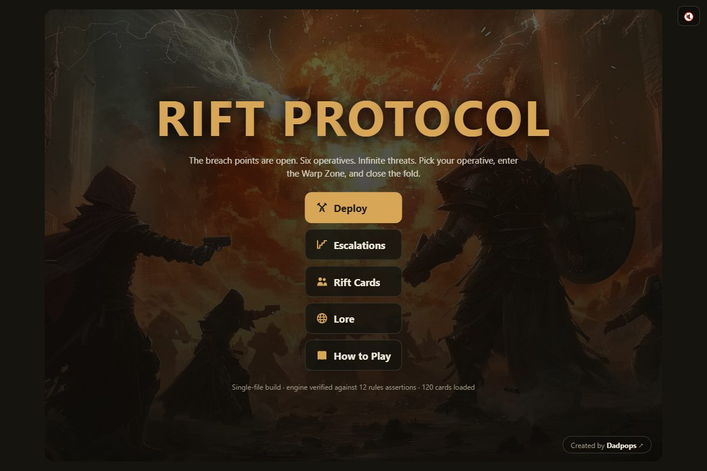
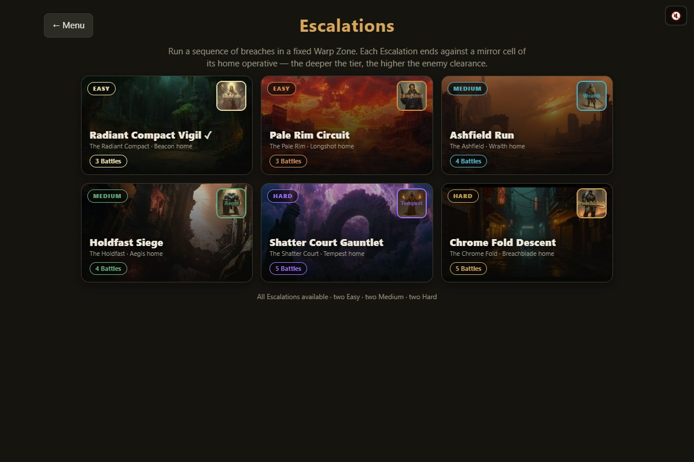
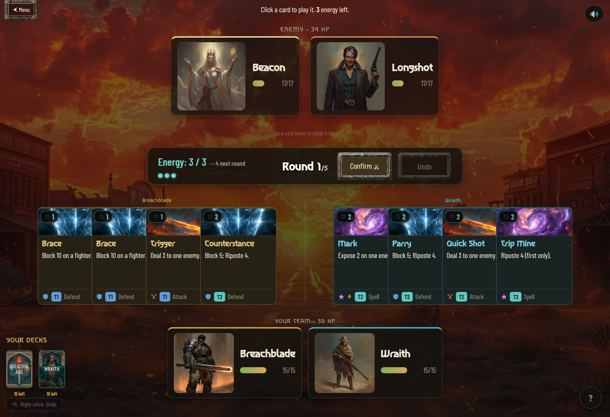
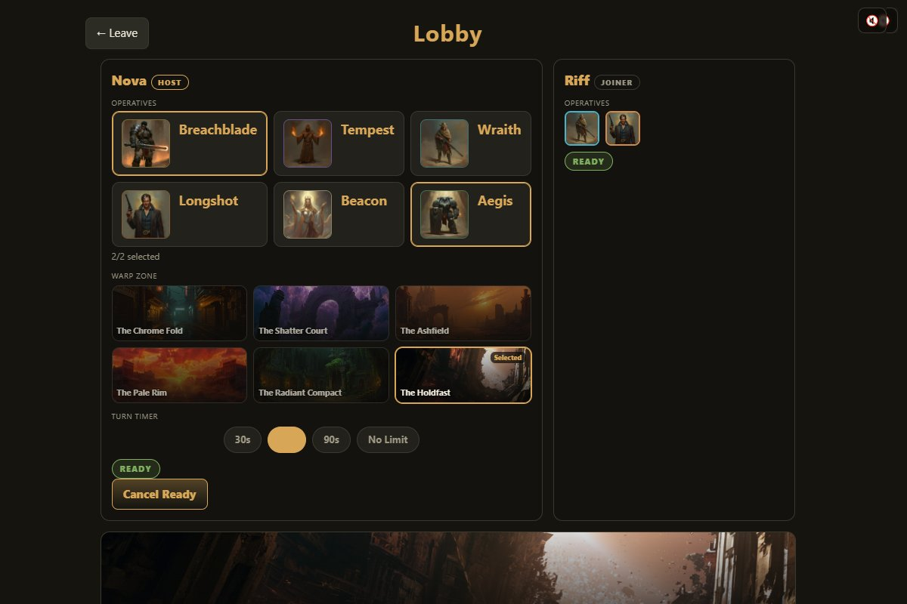
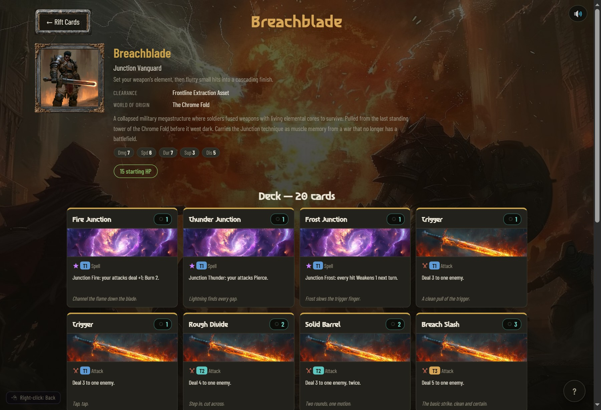

<div align="center">

# RIFT PROTOCOL

### A single-file, browser-based 2v2 turn-based card battler

_The breach points are open. Six operatives. Infinite threats._
_Pick your pair, enter the Warp Zone, and close the fold._



</div>

---

## What is it?

**RIFT PROTOCOL** is a tactical 2v2 card battler that runs entirely in the browser — no install, no build step. You command a pair of **RIFT operatives** (Rapid Interdimensional Field Team), each pulled from a collapsing world and fighting with that world's combat style. Stage your cards, confirm, and watch the round resolve in strict speed-tiers. Matches last about **3 minutes**.

- **6 operatives**, each a distinct archetype — **120 cards** total (20 per class)
- **Readable at a glance** — every card follows one short template with a shared **keyword vocabulary** (Pierce, Block, Guard, Riposte, Weaken…) and uniform sizing; hover on desktop or long-press on mobile for keyword reminders
- **~3-minute matches**, 5 rounds, deep enough to reward planning
- **Single-player vs AI** (4 difficulty tiers) and a **single-player Escalations ladder**
- **Online 1v1 multiplayer** over rooms + a chat lobby
- **Synthesized audio** (no audio files — every track + SFX is generated in the browser)
- **No backend required to play locally**; a lightweight Node server powers online play

---

## Screenshots

| Escalations ladder | Battle |
|---|---|
|  |  |

| Online lobby | Operative roster (Rift Cards) |
|---|---|
|  |  |

---

## The operatives

| Codename | Role | Home Warp Zone |
|---|---|---|
| **Breachblade** | Junction vanguard — set your weapon's element, then flurry | The Chrome Fold |
| **Tempest** | Elemental burst mage | The Shatter Court |
| **Wraith** | Evasive precision striker | The Ashfield |
| **Longshot** | Long-range control & gambits | The Pale Rim |
| **Beacon** | Frontline support & healing | The Radiant Compact |
| **Aegis** | Bulwark tank & blocks | The Holdfast |

Teams are **two different operatives**; pairings create the strategy. Balance is flat — a data-driven tuning pass holds every class within a ~2–3 point win-rate band, so there are no trap picks.

---

## How it plays

- **Energy ramps** each round (3 → 4 → 6 → 8 → 10). Cards cost by speed tier (T1=1 … T4=5).
- Each round you **stage** cards for your living operatives, choose targets, then **Confirm**.
- Cards resolve in **speed tiers T1 → T4**, simultaneous within a tier, with **interrupt-on-kill** — defenses played fast are already up when heavy hits land.
- **Blocks** are depletable pools; **pierce** ignores them. Burn, splash, ripostes, buffs and debuffs all interact.
- **5 rounds.** Wipe both enemies to win outright; otherwise the tiebreak is **most kills → most HP → draw**.

---

## Game modes

- **Deploy** — quick match vs AI. Four clearance tiers: **Recruit** (random), **Clasher** (reads the board), **Captain** (triage + focus-fire), **Warden** (knows every card pool, plays around your threats).
- **Escalations** — a single-player ladder of six runs across Easy/Medium/Hard. Each is a sequence of battles in a fixed Warp Zone, ending against a **mirror cell** of that zone's home operative, with the enemy clearance ramping as you climb.
- **Multiplayer (online 1v1)** — create a room, share the 4-character code, meet in a lobby (team + Warp Zone + turn-timer pickers, live sync, chat), then deploy. Host-authoritative netcode keeps both clients in sync; an optional turn timer keeps matches moving.

---

## Run it

### Play locally (no server needed)
Serve the folder over HTTP (art only loads over HTTP, not `file://`) and open the game:
```bash
python -m http.server 8124 --directory .
# → http://localhost:8124/rift_protocol.html
```

### Online multiplayer server
```bash
npm install            # express + socket.io
node server.js         # serves the game + sockets on :3000
```
Then point the client at the server by setting **`RIFT_SERVER_URL`** at the top of the `gf-ui` script in `rift_protocol.html` (defaults to `http://localhost:3000`). Deploy notes for **Railway** are in the header of [`server.js`](server.js). When deploying, use the **`https://`** server URL.

### Tests (Node 18)
```bash
node test/run_tests.mjs     # 12 spec assertions + headless sims
node test/regression.mjs    # 20 regression tests
```

---

## Under the hood

- **One file for the whole game:** [`rift_protocol.html`](rift_protocol.html)
  - `<script id="gf-core">` — the **DOM-free engine** (cards, rules, AIs, the 12 spec assertions, a headless simulator). Exported as `GF`, so it runs under Node for testing.
  - `<script id="gf-audio">` — **RiftAudio**, a self-contained Web Audio engine (synthesized music + SFX, no files).
  - `<script id="gf-ui">` — all DOM/animation, guarded on `document`.
- **`server.js`** — a pure relay/lobby server (Node + Express + Socket.io). It manages rooms, relays moves and chat, and runs the server-authoritative turn timer. It never runs the game engine.
- **Graceful art fallback** everywhere — the `artassets/` folder is intentionally incomplete; any missing image degrades to a colored placeholder.
- **Source of truth:** [`Rift_Protocol_Card_Reference.xlsx`](Rift_Protocol_Card_Reference.xlsx) (Rules + all cards + per-class sheets), regenerated from live card data.

---

## Status

- ✅ **12/12 spec assertions, 20/20 regression tests, 0 simulation errors**
- ✅ Class balance: ~2–3 pt win-rate spread across all six operatives (no clear best/worst)
- ✅ Single-player (Deploy + Escalations) and online 1v1 multiplayer implemented
- 🔜 Currently in **deploy & validate** for online play — see [ROADMAP.md](ROADMAP.md)

See [ROADMAP.md](ROADMAP.md) for where this is going next (the north star is single-player depth: progression/unlocks and richer Escalations).

## Credits

**Music**

- "The Game" by **Boss Bass** — source: [Free Music Archive](https://freemusicarchive.org/) · license: [CC BY-NC-SA 4.0](https://creativecommons.org/licenses/by-nc-sa/4.0/)
- "Sweet Lofi" by **VibeDepot** — source: [Free Music Archive](https://freemusicarchive.org/) · license: [CC BY-NC-SA 4.0](https://creativecommons.org/licenses/by-nc-sa/4.0/)

> ⚠️ These tracks are **CC BY-NC-SA**: **non-commercial use only**, and works that incorporate them are expected to be shared under the same license. Not cleared for monetized/commercial release or YouTube. Swap them out before any commercial use.

Fonts: **Asimovian** and **Barlow Condensed** (SIL Open Font License — see the `OFL.txt` files under `artassets/fonts/`).

---

<div align="center">

Created by **Dadpops**

</div>
